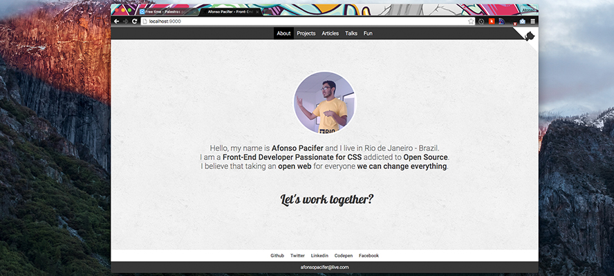

# My Personal Website
> Visit the website in  [afonsopacifer.com](http://afonsopacifer.com/)



## Pages

- [About](http://afonsopacifer.com/index.html) - About me :)
- [Projects](http://afonsopacifer.com/projects.html) - The list of open source projects developed.
- [Articles](http://afonsopacifer.com/articles.html) - The list of articles written.
- [Talks](http://afonsopacifer.com/talks.html) - The list of talks presented.
- [Demos](http://afonsopacifer.com/demos.html) - Demonstrations using some frameworks or tools.
- [Fun with CSS](http://afonsopacifer.com/fun-with-css.html) - Generally useless experiments , however great fun and generate great learning.

## Insert a new content

1 - Edit the data.json file and add the new content.

2 - Run the grunt task for build the static pages.

```sh
$ grunt build
```

## Tasks list

- `$ grunt build`: Compile, concat and minify all files
- `$ grunt serve`: Start the development ambient
- `$ grunt validation`: W3C html validation
- `$ grunt lint`: Lint the css
- `$ grunt autoprefixer`: Autoprefixer the css
- `$ grunt deploy`: Deploy for gh-pages

## Contributing

Want to contribute? [Follow these recommendations](https://github.com/afonsopacifer/my-personal-website/blob/master/CONTRIBUTING.md).

## Licence

[MIT Licence](https://github.com/afonsopacifer/my-personal-website/blob/master/LICENCE.md) © [Afonso Pacifer](http://afonsopacifer.com/)
